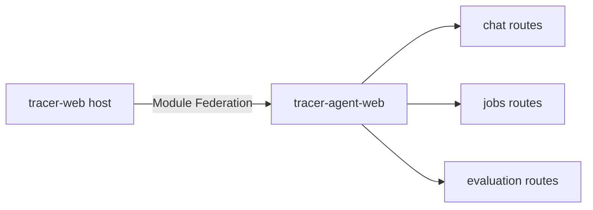
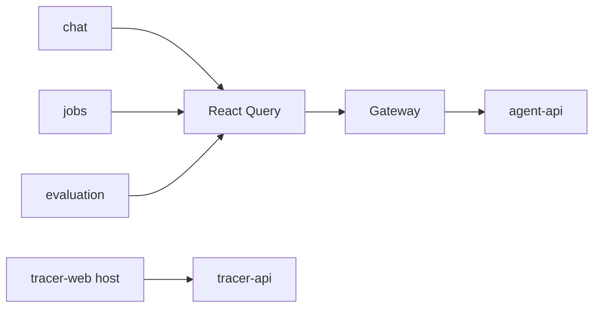

# tracer-agent-web

에이전트 서비스의 화면입니다. 대화와 잡과 평가를 보여주고 새 실행을 접수합니다. React 19와 Vite로 빌드하며 Module Federation 리모트로 추적 대시보드에 연결됩니다.

계약이 정한 HTTP 표면만 보므로 어느 구현체가 떠 있는지 알지 않습니다. API 서버가 아니고 데이터베이스도 갖지 않습니다. 빌드 산출물은 `remoteEntry.js`와 정적 청크이며, 추적 대시보드 호스트가 이것을 `/agent/` 경로 아래에 펼칩니다.

## 아키텍처



### 화면 상태와 API



| 영역 | 규칙 |
| --- | --- |
| Module Federation | `vite.config.ts`가 `./routes`를 내보내고 리모트 이름은 `agent`, 호스트 표면 이름은 `tracerWeb`입니다 |
| 공유 의존성 | react, react-dom, react-router-dom, @tanstack/react-query, zustand 를 singleton으로 공유합니다 |
| 자산 경로 | `base: "./"`가 청크 주소를 진입점 기준 상대 경로로 내므로 게이트웨이의 `/agent/` 접두어 아래에서 그대로 동작합니다 |
| 호스트 표면 | `types/host.d.ts`가 호스트가 실행 시점에 넘기는 표면의 타입을 갖습니다 |
| 화면 상태 | 서버 상태는 React Query가, 화면 상태는 컴포넌트 state와 공유 UI 스토어가 갖습니다 |

## 기능

- 대화 스레드·메시지·실행 단계와 실시간 실행 상태
- 잡 목록·필터·상세·경로와 결과 동작
- 데이터셋·프롬프트·실험·검토로 이루어진 평가 화면
- 구현체 선택
- 호스트 UI·라우터·singleton 공유
- 스트림과 폴링 대체 경로, React Query 캐시 동기화

## 요구 사항

- Node.js `>=24.0.0 <25.0.0` (`.nvmrc`)와 npm
- 실행 중인 추적 대시보드 호스트 또는 게이트웨이
- 닿을 수 있는 에이전트 API

## 설치와 개발

```bash
git clone https://github.com/agent-tracer/tracer-agent-web.git
cd tracer-agent-web
npm ci

npm run lint     # 형식·타입·구조·의존 검사
npm test
npm run dev      # Vite 개발 서버
npm run build    # remoteEntry 와 청크
npm run preview
```

단독 개발 서버는 리모트 자체를 확인하는 자리입니다. 실제 이동과 호스트 singleton 연동은 추적 대시보드 호스트에서 확인합니다.

API 주소를 저장소에 고정하지 않고 호스트와 게이트웨이의 경로를 씁니다. 두 구현체를 나란히 세우는 배치에서는 화면의 구현체 선택이 축을 고르며, 축이 없는 요청은 게이트웨이가 `400 agent_backend_ambiguous`로 거절합니다.

## Docker

```bash
docker build -t tracer-agent-web:latest .
```

이미지는 nginx가 빌드된 자산을 정적으로 제공합니다. 애플리케이션 서버도 데이터베이스도 담지 않습니다. `agent-tracer-stack`이 이 이미지의 `remoteEntry.js`를 게이트웨이의 `/agent/` 경로로 연결합니다.

## 저장소 구조

```text
tracer-agent-web/
├── src/
│   ├── entities/              chat·evaluation 의 API·모델과 도메인 UI
│   ├── features/              대화 전송·평가 편집·구현체 선택
│   ├── pages/                 chat·jobs·evaluation
│   ├── widgets/               chat·jobs 화면 조각
│   ├── routes.ts              호스트가 펼치는 라우트 배열
│   └── styles.css
├── types/host.d.ts            호스트 표면 타입
├── test/host/                 호스트 표면 대역과 계약 테스트
├── scripts/check-structure.mjs
├── architecture.manifest.mjs  FSD 레이어와 파일 예산
├── vite.config.ts             연합 내보내기와 singleton
└── Dockerfile
```

## 개발 컨벤션

Feature-Sliced Design 레이어는 `app → pages → widgets → features → entities → shared` 방향으로만 의존하고, 같은 레이어의 슬라이스끼리는 서로를 부르지 않습니다. 호스트가 주는 표면은 `tracerWeb` 접두어로, 이 저장소의 소스는 `~/` alias로 가리킵니다. 규칙의 정본은 `architecture.manifest.mjs`이며 구조 검사기와 의존 그래프 검사기가 이것을 읽습니다.

구조 검사는 순환 import, 풀리지 않는 import, 레이어 역방향 의존, 슬라이스 사이의 의존을 막습니다. 소스 파일은 300줄 안에 두고 넘으면 책임을 나눕니다. 라우트 배열과 연합 내보내기를 바꿀 때는 호스트의 라우트 해석도 함께 확인하고, 응답 매퍼나 계약 필드를 바꿀 때는 계약 테스트와 실제 에이전트 API를 함께 검증합니다.

```bash
npm run lint
npm test
npm run build
```

## 관련 저장소

- [agent-tracer](https://github.com/agent-tracer/agent-tracer) — 연합 호스트와 추적 API
- [tracer-agent-contract](https://github.com/agent-tracer/tracer-agent-contract) — 에이전트 API 계약
- [tracer-agent-ts](https://github.com/agent-tracer/tracer-agent-ts) — TypeScript 에이전트 API
- [tracer-agent-python](https://github.com/agent-tracer/tracer-agent-python) — Python 에이전트 API
- [agent-tracer-stack](https://github.com/agent-tracer/agent-tracer-stack) — 게이트웨이와 구현체 선택

## 라이선스

MIT License
